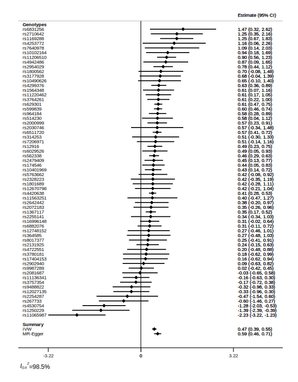
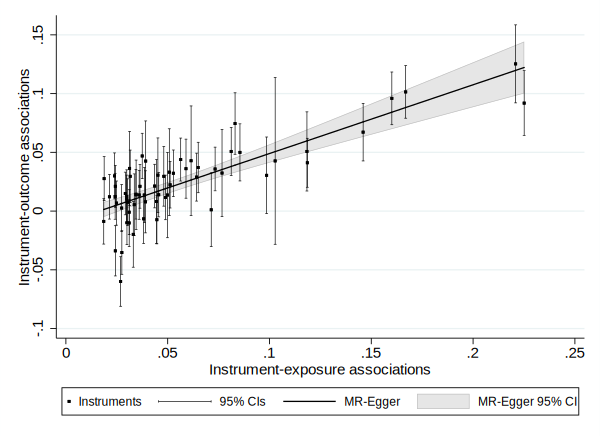

## Introduction

This example shows how to run R and Stata code within the same Stata Markdown (`.stmd`) script. The general approach is detailed on the Stata Markdown website [here](https://data.princeton.edu/stata/markdown/quantiles) and [here](https://data.princeton.edu/stata/markdown/gettingStarted#R).

This means that we can use the functions provided by the [`TwoSampleMR`](https://github.com/MRCIEU/TwoSampleMR) package to obtain data from [MR-Base](http://www.mrbase.org/).

To see the `stmd` code which generates this page see [here](https://raw.githubusercontent.com/remlapmot/mrrobust/master/_drafts/markstat-call-R-example/markstat-call-R-example.stmd). You will see that the file is written in markdown and includes R and Stata code chunks.

Before you start please install the following two Stata packages from the SSC archive, so in Stata issue the following commands (I have commented them out because I have already installed them).

{{1}}


We first need to register the R executable with Stata.

{{2}}


Next we have an R code chunk in which we install the required packages in R (again I have commented these lines out because I already have them installed).

{{r1}}


We will be running the script from the MR-Base paper ([Hemani et al., 2018](https://doi.org/10.7554/eLife.34408)). The R code we will use is from [here](https://raw.githubusercontent.com/explodecomputer/mr-base-methods-paper/master/scripts/ldl-chd.R).

First, we load the packages into our R session. Note that the `foreign` package provides the `write.dta()` function which we will use to save the data in Stata format.

{{r2}}


Our edited version of the code starts by reading in some code to generate a set of plots in R.

{{r3}}


We can access the data using the `MRInstruments` package.

{{r4}}

At this point we have our harmonised genotype-exposure and genotype-outcome association data saved in an object in our R session called `dat`.

The next two code chunks perform the analysis in R.

{{r5}}


{{r6}}


We now save our `dat` object as a Stata dataset.

{{r7}}


We now switch from using R code chunks to Stata code chunks. We read the data into Stata and list the variable names (note any `.` in the colnames of `dat` have been replaced with `_`).

{{3}}


We can then run the IVW model using `mregger` with multiplicative standard errors.

{{4}}


It is helpful to view the forest plot of genotype specific IV estimates.

{{5}}




We can visualise this model with `mreggerplot`.

{{6}}




We then fit the MR-Egger, median, and modal based estimators.

{{7}}


{{8}}


{{9}}


And we could continue with additional Stata code (or indeed R code) as we liked.

Note to run this `.stmd` file in Stata we do so with the following command (specifying additional options as required, see `help markstat` for more information).
```
markstat using markstat-call-R-example
```

## References

- Hemani et al. The MR-Base platform supports systematic causal inference across the human phenome. eLife, 2018;7:e34408 <https://doi.org/10.7554/eLife.34408>
